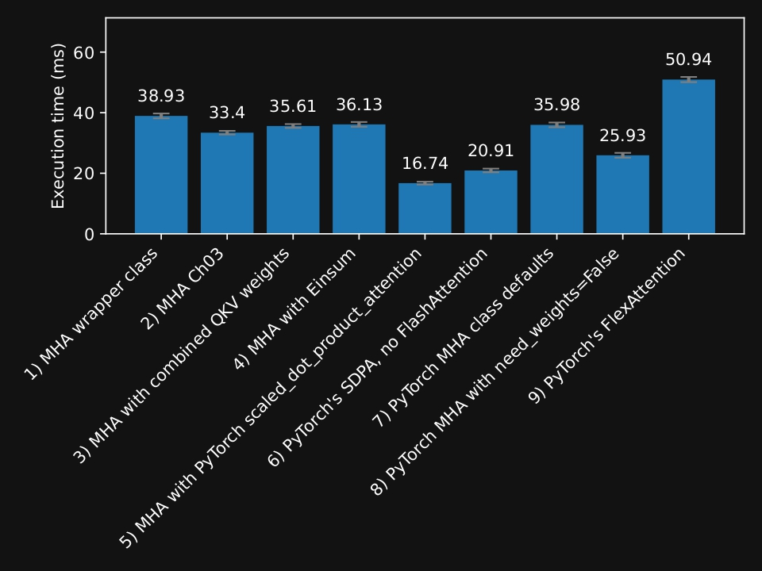
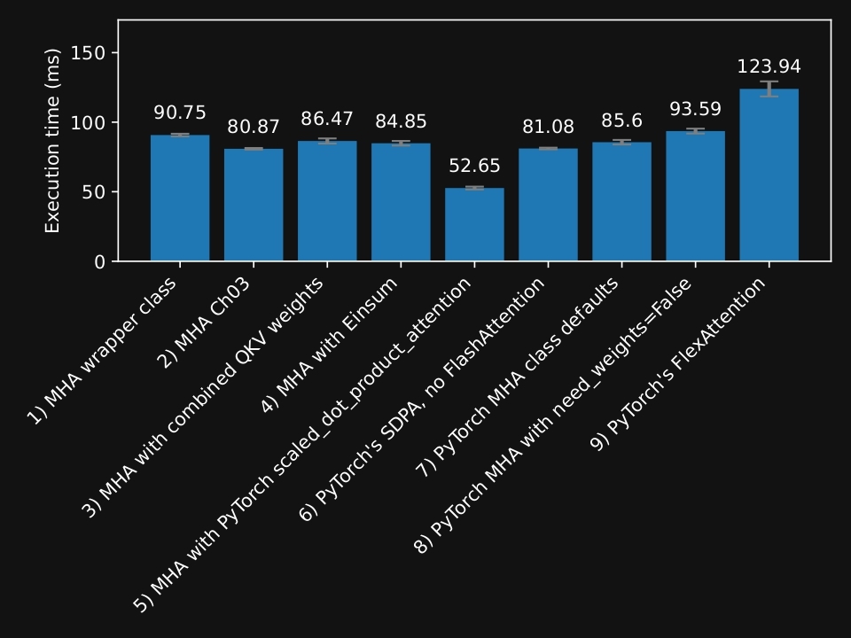
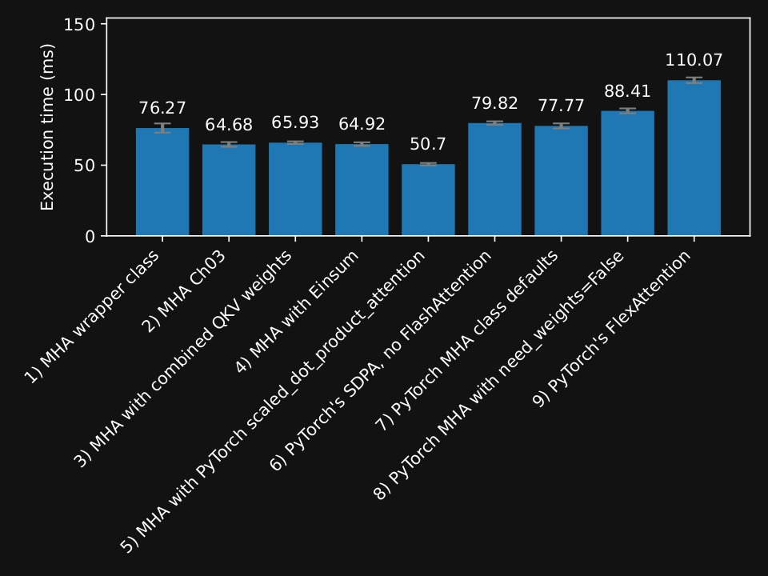

# Ch 3: Coding Attention Mechanisms 
---

1. Exploring the reasons for using attention mechanisms in neural networks
2. Introducing a basic self-attention framework and progressing to an enhanced self-attention mechanism
3. Implementing a causal attention module that allows LLMs to generate one token at a time
4. Masking randomly selected attention weights with dropout to reduce overfitting
5. Stacking multiple causal attention modules into a multi-head attention module

## Bonus: Efficient Multi-Head Attention Implementations
---

The figures below summarize the performance benchmarks (lower is better).

### Forward pass only

### Forward and backward pass

### Forward and backward pass after compilation

## Bonus: Efficient Multi-Head Attention Implementations
---

The figures below summarize the performance benchmarks (lower is better).

<table>
  <tr>
    <td align="center">
      <strong>Forward pass only</strong> 
      
    </td>
    <td align="center">
      <strong>Forward and backward pass</strong> 
      
    </td>
    <td align="center">
      <strong>After compilation</strong> 
      
    </td>
  </tr>
</table>
